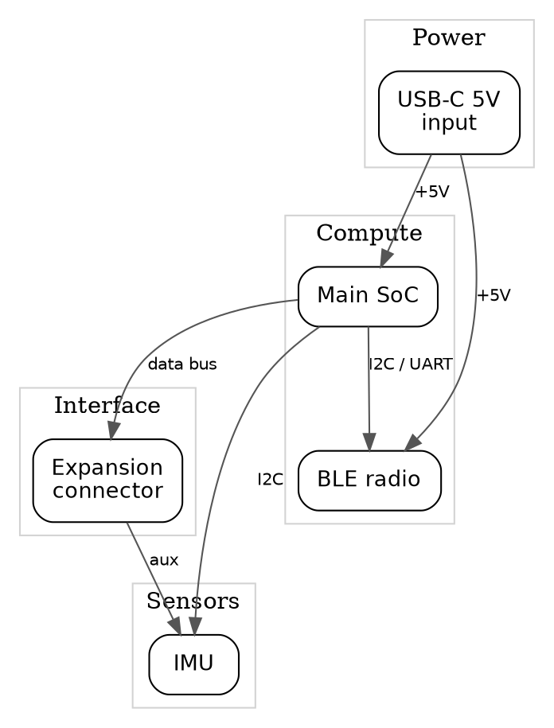
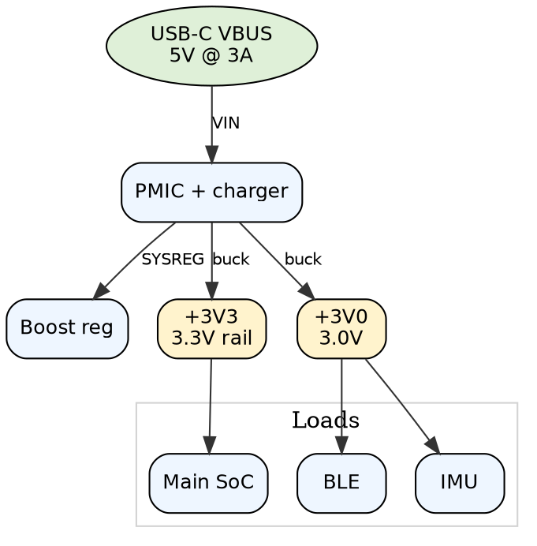

# Architecture Diagrams — Mandatory Format Spec

## Purpose
Every EE review must open with two architecture diagrams **before** any
checklist findings. They establish the design's topology so detailed findings can
be cross-checked against the intended architecture, and they give non-expert
stakeholders a fast mental model.

**Format: Graphviz DOT (`.dot`), rendered with `dot`.** This is the fixed format
for the skill — do not substitute drawio, hand-drawn SVG, or PNG-only output.
Always ship the `.dot` source plus rendered `.png`/`.svg`.

## General style rules (apply to BOTH diagrams)
- **Layered, top-to-bottom** (`rankdir=TB`) unless the design reads better
  left-to-right.
- **No internal detail**: no pins, no decoupling caps, no feedback networks, no
  sub-symbols. A block is a labelled box; an edge is a labelled connection.
- **Net labels on edges**: every edge carries the net / signal / rail name as its
  label. Modules connect by net name — never by pin number.
- Light background, rounded boxes, Helvetica, restrained palette. Readable, not
  decorative.
- Group related blocks into `subgraph cluster_*` with a grey background and a
  layer label (e.g. "Compute", "Power", "Sensors").

## 1. System block diagram
File: `<project>_system_block_diagram.dot`

Shows the top-level functional modules of the whole design and how they talk.
One block per functional module (MCU, PMIC, radio, sensor, connector, …); the
number of blocks follows the design, not a fixed count. Edges are functional
links (bus, power, data) labelled with the net name.

DOT template (adapt blocks/labels to the actual design):



## 2. Power tree
File: `<project>_power_tree.dot`

Shows the power architecture as a tree: source → regulator/PMIC → output rails
→ major loads. Annotate each rail block with its voltage and typical current;
annotate regulator edges with the conversion type (buck/boost/LDO). No schematic
detail (skip decoupling, feedback, compensation).

DOT template:



## Render
```bash
dot -Tpng -o <project>_system_block_diagram.png <project>_system_block_diagram.dot
dot -Tsvg -o <project>_system_block_diagram.svg <project>_system_block_diagram.dot
dot -Tpng -o <project>_power_tree.png <project>_power_tree.dot
dot -Tsvg -o <project>_power_tree.svg <project>_power_tree.dot
```

## Placement
Put all generated deliverables (report HTML + the four diagram files) in the
PROJECT directory — the same folder that holds the source schematic/board files.
Do not place them in the WorkBuddy workspace or a separate deep subfolder. The
coverage table must cite the diagram file paths as evidence.
