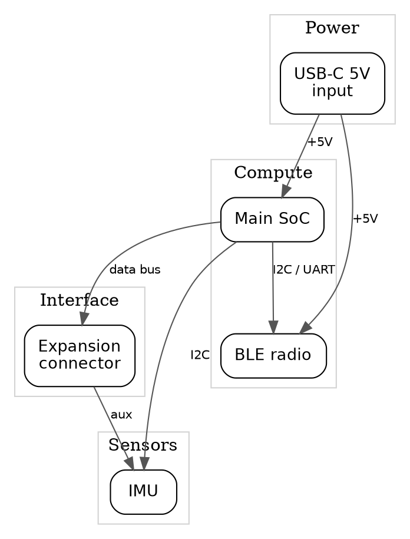
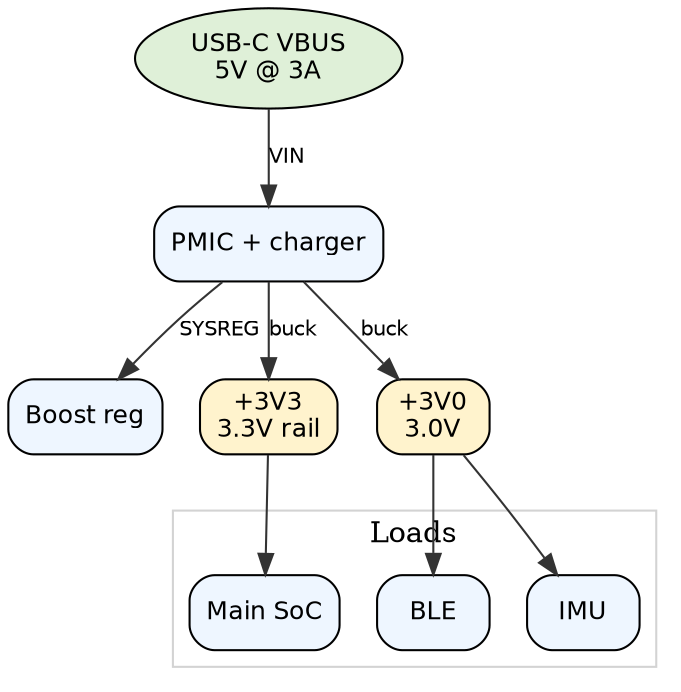

# Architecture diagrams

## When to draw

A multi-board design requires the system block diagram. Do not ask to skip it. One block cluster per board, and every net that leaves one board for another (I2C, power, reset, a bus) is an edge labelled with that net. If the other board's schematic is not in the review, the row is `not verifiable` and you ask for that schematic. Do not invent the other board.

For a single board, decide separately for the system block diagram and the power tree. Draw a diagram when the topology would change a finding: more than one power stage, more than one functional module, or a conclusion that depends on which block or rail feeds another. A single regulator feeding one IC, or a diagram the user already supplied, does not need a new drawing.

If you decide a single-board diagram is not needed, ask the user before skipping it. Do not mark that coverage row `not applicable` until they confirm. If they say to draw it, draw it. If they confirm the skip, status is `not applicable` and the evidence is their confirmation. The power tree of a multi-board design still follows this ask-before-skip rule, except that a battery product requires the power tree. The system block diagram does not.

A battery product requires the power tree. Do not ask to skip it. After any power tree is drawn, review every regulator against source sag in `references/schematic-review.md`. The sag is the voltage drop at the shared upstream node under the highest peak on that node, including a cell, VBUS, an adapter, a cable, or an intermediate rail.

BOM-only, Gerber-only, or a PCB with neither schematic nor netlist: do not invent a drawing from the parts list. Ask the user. If they want the diagram, ask for a schematic or a netlist first. Evidence when there is still nothing to draw from: `no schematic or netlist in this review`.

When you do draw one, put the `.dot`, `.png`, and `.svg` files in `<project>/ee-review/`, before checklist findings. If you decided the diagram is needed and the file is missing, that row is `not verifiable` and Power Supply Design gets a warning that names the missing path.

**Format: Graphviz DOT (`.dot`), rendered with `dot`.** Do not substitute drawio, a hand-drawn SVG, or a PNG with no `.dot` source. Always ship the `.dot` plus rendered `.png` and `.svg`.

## Purpose

The diagrams fix the topology so later findings can be checked against it. They are not evidence that a net was reviewed. Connection claims still need the parser lookup in `references/netlist-verification.md`.

## General style rules (apply to BOTH diagrams)
- **Layered, top-to-bottom** (`rankdir=TB`) unless the design reads better
  left-to-right.
- **No internal detail**: no pins, no decoupling caps, no feedback networks, no
  sub-symbols. A block is a labelled box; an edge is a labelled connection.
- **Net labels on edges**: every edge carries the net / signal / rail name as its
  label. Modules connect by net name — never by pin number.
- Light background, rounded boxes, Helvetica, restrained palette. Readable, not
  decorative.
- Group related blocks into `subgraph cluster_*` with a grey background and a
  layer label (e.g. "Compute", "Power", "Sensors").

## 1. System block diagram
File: `ee-review/<project>_system_block_diagram.dot`

Shows the top-level functional modules of the whole design and how they talk.
One block per functional module (MCU, PMIC, radio, sensor, connector, …); the
number of blocks follows the design, not a fixed count. Edges are functional
links (bus, power, data) labelled with the net name.

DOT template (adapt blocks/labels to the actual design):



## 2. Power tree
File: `ee-review/<project>_power_tree.dot`

Shows the power architecture as a tree: source → regulator/PMIC → output rails
→ major loads. Annotate each rail block with its voltage and typical current;
annotate regulator edges with the conversion type (buck/boost/LDO). No schematic
detail (skip decoupling, feedback, compensation).

DOT template:



## Render
```bash
dot -Tpng -o ee-review/<project>_system_block_diagram.png ee-review/<project>_system_block_diagram.dot
dot -Tsvg -o ee-review/<project>_system_block_diagram.svg ee-review/<project>_system_block_diagram.dot
dot -Tpng -o ee-review/<project>_power_tree.png ee-review/<project>_power_tree.dot
dot -Tsvg -o ee-review/<project>_power_tree.svg ee-review/<project>_power_tree.dot
```

## Placement
Put every file this review writes in `<project>/ee-review/`: the HTML report, the `.dot` sources, and the rendered `.svg` and `.png`. Datasheet PDFs go in `ee-review/datasheets/`. The coverage table cites those paths.
